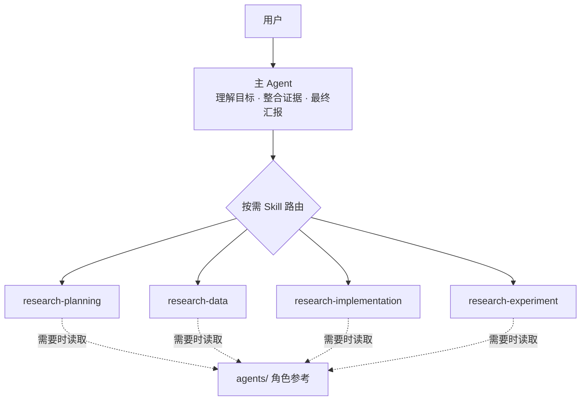

# ResearchManager

一套面向科研与工程实验的轻量多 Agent 协作规范。它解决的不是“让更多 Agent 同时工作”，而是让研究规划、数据、实现和正式实验之间有清晰边界，同时利用 Skill 的按需加载减少长期上下文负担。

## 架构



`AGENTS.md` 只保留长期成立的全局合同；`.agents/skills/` 负责可识别用户目标的具体 workflow；`agents/` 保存稳定角色的详细职责并在 skill 触发后按需读取。这样主 Agent 不需要在每次请求中预加载完整科研 SOP。

## 核心原则

- **薄全局合同**：只把指令优先级、授权边界、证据要求和完成定义放进 `AGENTS.md`。
- **窄 Skill 触发**：每个 skill 对应一个清晰任务类型，并在 `description` 中同时写明适用与不适用场景。
- **渐进加载**：先依赖 skill 的 `name + description` 做路由，触发后才读取完整 `SKILL.md` 和必要参考文档。
- **偏向完成**：目标明确、可逆、低风险的工作直接推进到完成，不为每一步机械请求确认。
- **重大边界才规划**：只有研究问题、数据语义、核心接口、评价标准、物理边界等发生实质变化时才要求 Draft Plan。
- **稳定角色**：继续复用 `data_manager`、`implementation_manager`、`experiment_manager`，但不把角色文档作为常驻上下文。
- **可复现证据**：数据、配置、正式实验保留版本、命令、路径和验证结果，失败也作为证据记录。

## 文件结构

```text
AGENTS.md
.agents/
  skills/
    research-planning/
      SKILL.md
    research-data/
      SKILL.md
    research-implementation/
      SKILL.md
    research-experiment/
      SKILL.md
agents/
  README.md
  data_manager.md
  implementation_manager.md
  experiment_manager.md
docs/
  WORKFLOW.md
  SKILL_EVALS.md
templates/
  DECISIONS.md
  EXPERIMENT_LOG.md
  TASK_HISTORY.md
```

## 使用方式

1. 将 `AGENTS.md`、`.agents/skills/`、`agents/` 和需要的 `templates/` 放到研究项目根目录。
2. 在项目级 `AGENTS.md` 中只补充真正长期成立的领域、硬件、安全和不可逆操作约束；不要把临时项目流程继续堆进去。
3. Codex 从 repo 的 `.agents/skills/` 发现工作流；主 Agent根据 skill description 选择最窄的匹配项。
4. skill 触发后，再按其中的说明读取 `agents/`、`docs/WORKFLOW.md` 或项目代码/数据。
5. 用 `docs/SKILL_EVALS.md` 的正例、反例和边界请求定期检查 skill 路由是否退化。
6. 将模板复制到项目的 `docs/`，持续记录决策、实验和实现历史。

详细生命周期见 [docs/WORKFLOW.md](docs/WORKFLOW.md)。
