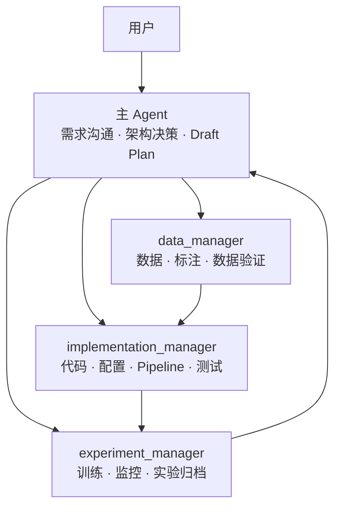

# ResearchManager

一套面向科研与工程实验的轻量多 Agent 协作规范。它解决的不是“让更多 Agent 同时工作”，而是让需求、数据、实现和实验之间有清晰边界，结果能够复现和追溯。

## 组织架构



主 Agent 就是架构负责人，不再额外设置 `architecture_manager`。Pipeline 属于实现工作，因此由 `implementation_manager` 负责。只有出现真实的多机、多 GPU 调度冲突时，才考虑增加资源管理角色。

## 核心原则

- 先自然讨论需求，每轮只解决少量关键问题。
- 信息足够后由主 Agent 给出 Draft Plan。
- 用户确认计划前，不安排完整实现或正式实验。
- 使用少量、稳定、可复用的角色，避免按一次性任务反复创建 Agent。
- 数据、实现、实验必须逐级交接，主 Agent 是唯一对用户汇报的协调者。
- 早期数据、配置和实验结果保留，使用新版本路径，不覆盖历史证据。
- 项目记录描述研究问题、决策与结果，不记录无关的 Agent 对话。

## 文件结构

```text
AGENTS.md
agents/
  README.md
  data_manager.md
  implementation_manager.md
  experiment_manager.md
docs/
  WORKFLOW.md
templates/
  DECISIONS.md
  EXPERIMENT_LOG.md
  TASK_HISTORY.md
```

## 使用方式

1. 将 `AGENTS.md`、`agents/` 和需要的 `templates/` 复制到研究项目根目录。
2. 在项目的 `AGENTS.md` 中补充领域约束、数据合同和安全边界。
3. 主 Agent 根据 `agents/README.md` 路由任务。
4. 将模板复制到项目的 `docs/`，持续记录决策、实验和实现历史。

详细生命周期见 [docs/WORKFLOW.md](docs/WORKFLOW.md)。
